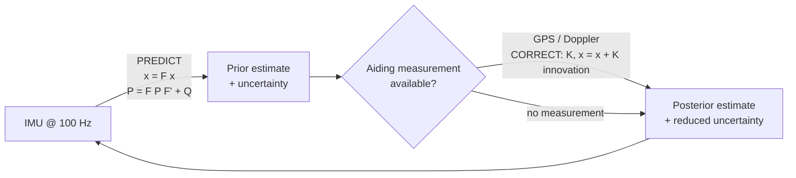

# Lesson 1 — Why Sensor Fusion?

**Next:** [Lesson 2 — EKF Foundations](02-ekf-foundations.md)

---

## Learning objectives

After this lesson you can:

1. Explain why inertial navigation alone always drifts, and why the drift grows with $t^2$.
2. Name the complementary strengths and weaknesses of an IMU, GPS, and a Doppler range/range-rate beacon.
3. Describe, at system level, what an Extended Kalman Filter (EKF) does in a fusion architecture.
4. Run all three demo scripts in this repository and know what each one teaches.

---

## 1. The problem: dead reckoning always drifts

An inertial navigation system (INS) measures acceleration and rotation, then integrates:

$$
v(t) = v_0 + \int_0^t a(\tau)\, d\tau, \qquad
p(t) = p_0 + \int_0^t v(\tau)\, d\tau
$$

Integration is the problem: **every error in the measurements accumulates forever.**
A constant accelerometer bias $b$ (a real, unavoidable sensor defect) produces a
velocity error $b\,t$ and a position error $\tfrac{1}{2}b\,t^2$:

| Time | Position error from $b = 0.03\ \mathrm{m/s^2}$ |
|------|------------------------------------------------|
| 10 s | 1.5 m |
| 30 s | 13.5 m |
| 60 s | 54 m |

A gyroscope bias adds a second, nastier channel: heading error $\tilde\psi$ grows
linearly, and a vehicle that points in a slightly wrong direction integrates
velocity into position in the wrong direction — cross-track error grows roughly
like $v\,\tilde\psi\,t$.

The saving grace: this drift is *slow* and *low-frequency*. It does not need to be
measured at high rate to be corrected — it needs to be corrected **occasionally and
absolutely**. That is exactly what external aids provide.

## 2. The sensor cast

| Sensor | Rate | Error character | Weakness |
|---|---|---|---|
| **IMU** (accelerometer + gyro) | 100 Hz | Integratable, smooth, high rate | Drifts without bound (bias, noise) |
| **GPS** | 1 Hz | Bounded noise (~2 m, ~0.15 m/s) | Low rate, no attitude information |
| **Doppler beacon** (range + range-rate) | 10 Hz | Bounded noise (0.5 m, 0.05 m/s) | Only observes geometry *relative to one point* — quality depends on geometry |

No single sensor is sufficient. The INS provides bandwidth, the aids provide
absolute truth. Fusion is the art of combining them according to how much you
trust each *at every instant* — which is precisely what a Kalman filter computes.

## 3. The estimator in the middle

An EKF maintains two things at all times:

- a **state estimate** $\hat{x}$ (position, velocity, heading, sensor biases, ...), and
- an **error covariance** $P$ — an honest claim of how wrong the estimate might be.

It loops over two steps:



- **Predict** (every IMU sample): propagate the state and *grow* the uncertainty,
  because the inertial sensors are imperfect.
- **Correct** (whenever an aid reports): compare the measured quantity against the
  predicted one, and blend — the Kalman gain $K$ decides how much to trust the
  measurement versus the prediction, based on the covariances.

*Why "extended"?* A plain Kalman filter only works when the dynamics and measurements
are **linear** in the state. Real vehicles rotate; range to a beacon is
$\sqrt{(x-x_b)^2 + (y-y_b)^2}$. The EKF handles this by linearising the models
around the current estimate — the subject of Lessons 5–6.

## 4. What is in this repository

| Script | Model | What it teaches |
|---|---|---|
| `Demo1D.m` | 1D linear, constant acceleration | EKF foundations; Monte Carlo validation; how GPS/Doppler aid kills INS drift (Lesson 3–4) |
| `NonLinear2D.m` | 2D nonlinear, curving trajectory | Jacobians, heading, 8-state EKF, and how the same Doppler aid can *fail* on geometry (Lesson 5–6) |
| `TwoBeacon2D.m` | 2D nonlinear, beacons only | Observability: why one beacon is not enough and a second one fixes everything (Lesson 6) |

## 5. Running the demos

You need [GNU Octave](https://octave.org) (developed and tested on 11.1; anything ≥ 7 should work).

```bash
# Debian/Ubuntu
sudo apt install octave
# macOS
brew install octave
```

Then, from the repository root:

```bash
octave Demo1D.m        # ~40 s   (10 figures + console summary)
octave NonLinear2D.m   # ~3 min  (9 figures + console summary)
octave TwoBeacon2D.m   # ~3 min  (4 figures + console summary)
```

Each script runs a **50-run Monte Carlo**: the constant sensor biases are redrawn
for every run, so the figures show how a *family* of filters behaves, not one
lucky realisation.

## 6. How to read the plots in this repository

All Monte Carlo error plots use the same colour language:

- **Light grey** — every individual Monte Carlo run's error trajectory.
- **Red** — the filter's *claimed* 1-sigma bound, $\sqrt{P}$, averaged over runs
  ("what the filter thinks its error should be").
- **Blue** — the *empirical* 1-sigma: the standard deviation of the actual error
  across the 50 runs ("what the error really is").

> Red ≈ blue means the filter is **consistent** — it knows what it doesn't know.
> Blue ≫ red means the filter is **overconfident** — the single most important
> warning sign in filter design. You will learn to diagnose this in Lesson 4.

---

> ### Learning points
> - INS drift is integration of sensor error: bias $b$ → $\tfrac{1}{2}bt^2$ position error.
> - Drift is slow and low-frequency; it does not need high-rate correction, it needs *absolute* correction.
> - IMU = bandwidth, aids = truth. The Kalman gain is the formal "trust allocation" between them.
> - A filter that cannot say how wrong it might be ($P$) is useless for fusion — covariance is a first-class output.

---

### Try it yourself

**Exercise 1.1** — Before running anything: in `Demo1D.m`, the vehicle accelerates
at $0.5\ \mathrm{m/s^2}$ for 50 s from rest. Predict the final position, then check
against the script's console output ("TRUE VEHICLE TRAJECTORY").

<details>
<summary><em>Solution</em></summary>

$p = \tfrac{1}{2}at^2 = 0.5 \cdot 0.5 \cdot 50^2 = 625\ \mathrm{m}$, final velocity
$v = at = 25\ \mathrm{m/s}$. The script prints exactly this.

</details>

**Exercise 1.2** — Using the table in Section 1, predict the INS-only position RMSE
at $t = 50$ s in `Demo1D.m` (accelerometer bias sigma $0.05\ \mathrm{m/s^2}$). Run
the script and compare with the "INS only" row of the final summary table.

<details>
<summary><em>Solution</em></summary>

RMS position error $\approx \tfrac{1}{2}\sigma_b t^2 = 0.5 \cdot 0.05 \cdot 2500 = 62.5\ \mathrm{m}$.
The simulation reports ~75 m — the remainder comes from accelerometer white noise and
the RMS over runs of a distribution of biases. Order of magnitude and scaling are right.

</details>

---

**Next:** [Lesson 2 — EKF Foundations](02-ekf-foundations.md)
