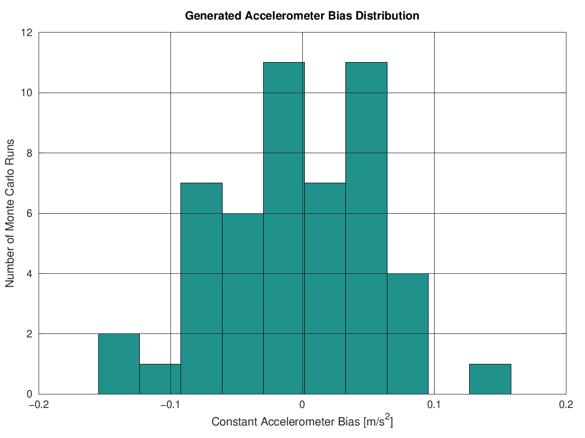
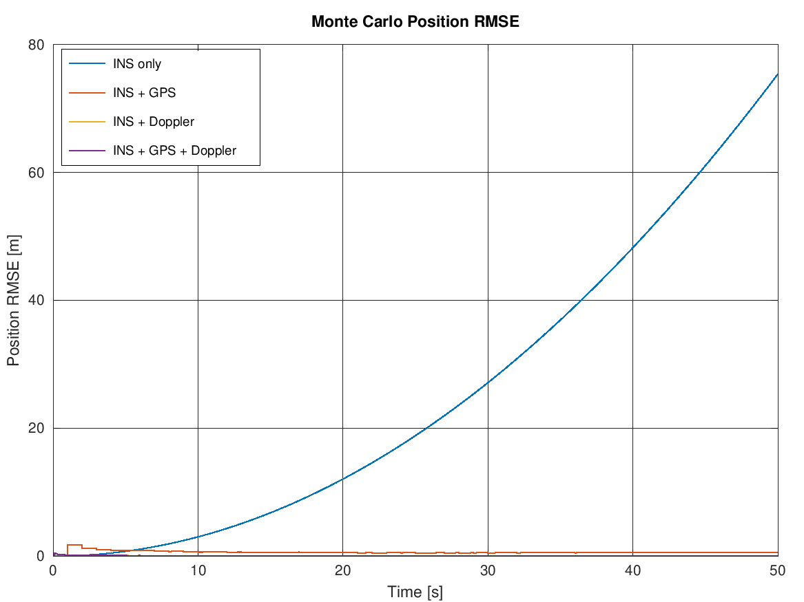
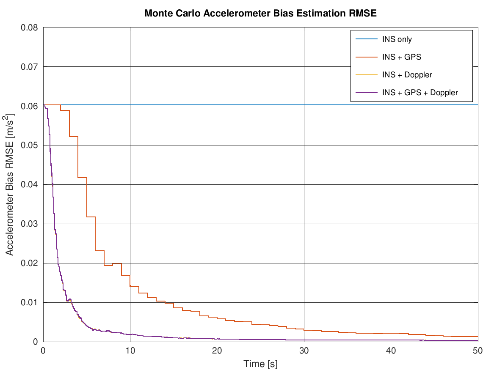
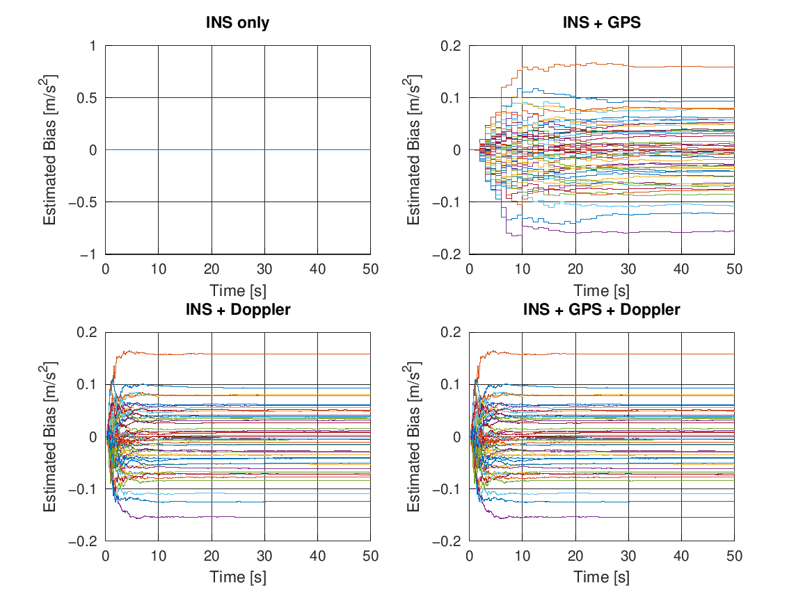
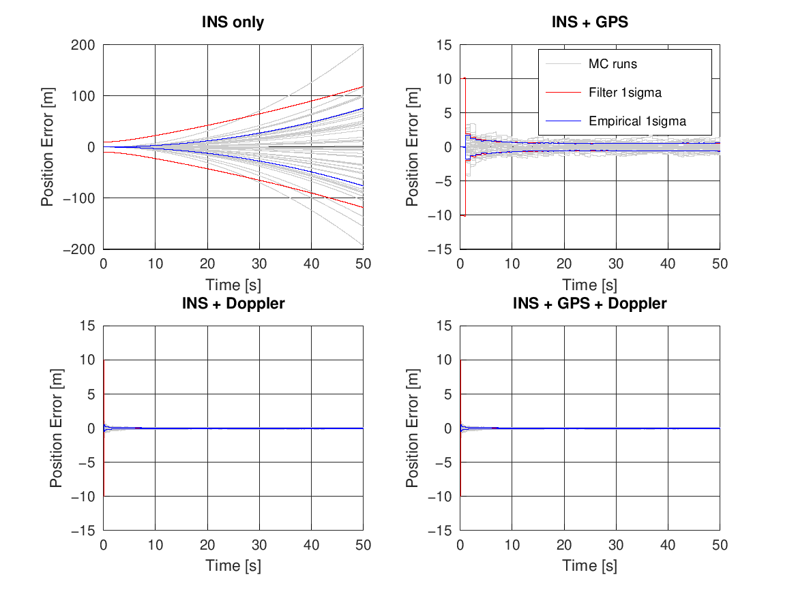
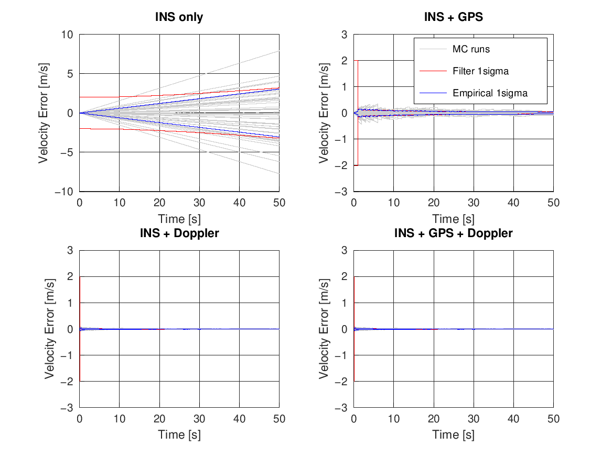
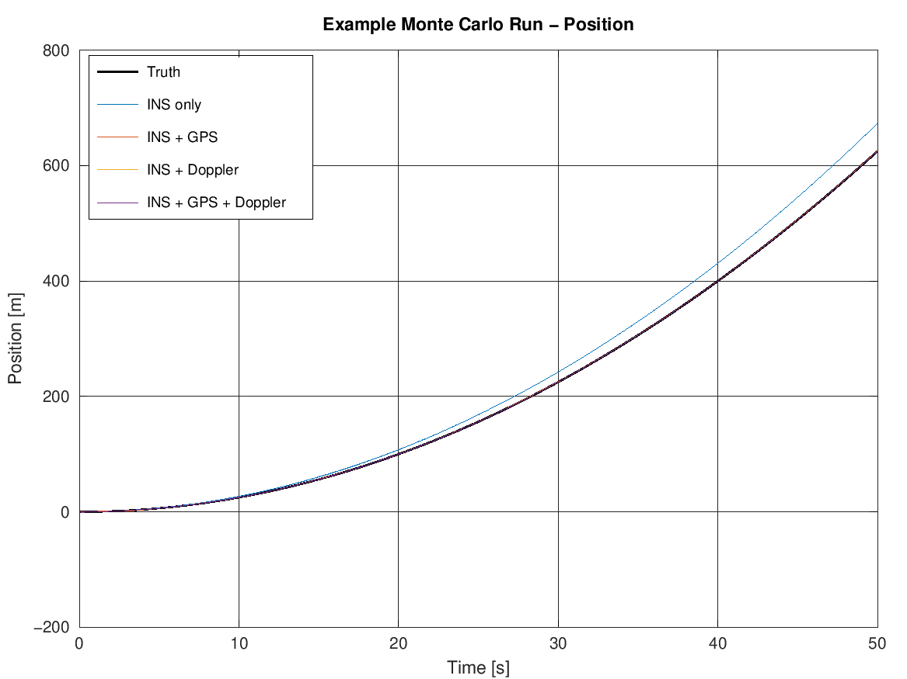

# Lesson 3 — 1D Linear Walkthrough (`Demo1D.m`)

**Previous:** [Lesson 2 — EKF Foundations](02-ekf-foundations.md)
**Next:** [Lesson 4 — Monte Carlo Validation](04-monte-carlo-validation.md)

---

## Learning objectives

After this lesson you can:

1. Read `Demo1D.m` end-to-end and connect every block to the equations of Lesson 2.
2. Explain why the accelerometer bias is a state, and how aiding makes it observable.
3. Interpret each figure the script produces, including the standardized
   grey/red/blue Monte Carlo plots.
4. Explain *why* the Doppler beacon is so devastatingly effective in 1D
   (and be ready for the 2D twist in Lesson 6).

---

## 1. Scenario

One vehicle, one axis. Constant acceleration $a = 0.5\ \mathrm{m/s^2}$ from rest,
for 50 s: position runs 0 → 625 m, velocity 0 → 25 m/s.

Aiding sensors:

- **GPS** at 1 Hz: position and velocity, $\sigma = 2$ m / $0.15$ m/s.
- **Doppler beacon** at 10 Hz, fixed at $x_b = 1000$ m *ahead* of the vehicle
  ([Demo1D.m:202](../Demo1D.m#L202)). The vehicle approaches it from 1000 m down to
  375 m range and never crosses it — the line-of-sight sign stays $+1$ throughout,
  keeping the geometry clean for now.

Four estimators run **in parallel on identical sensor data**: INS only, INS+GPS,
INS+Doppler, INS+GPS+Doppler. Every Monte Carlo run redraws the constant
accelerometer bias ($\sigma_b = 0.05\ \mathrm{m/s^2}$,
[Demo1D.m:326](../Demo1D.m#L326)) and fresh sensor noise, then feeds *the same
realisation to all four filters* — so any performance difference is purely due to
the aiding, never to luck.

## 2. The state and the model

State: $X = [p,\ v,\ b]^\top$ — position, velocity, **accelerometer bias**.

$$
p_{k+1} = p_k + v\,dt + \tfrac{1}{2}(a_{meas} - b)\,dt^2, \quad
v_{k+1} = v_k + (a_{meas} - b)\,dt, \quad
b_{k+1} = b_k
$$

This model is *exactly* linear in the states, so this is a true Kalman filter —
no approximations anywhere. The dynamics matrix
([Demo1D.m:306](../Demo1D.m#L306)):

$$
F = \begin{bmatrix} 1 & dt & -\tfrac{1}{2}dt^2 \\ 0 & 1 & -dt \\ 0 & 0 & 1 \end{bmatrix}
$$

The $-b$ column is worth staring at: it says "an uncompensated bias accelerates me
backwards". Initial covariance ([Demo1D.m:456](../Demo1D.m#L456)):

$$
P_0 = \mathrm{diag}(10^2,\ 2^2,\ \sigma_b^2)
$$

We claim "position could be off by ~10 m" (it isn't — initialization is at truth —
but the filter must not know that) and "bias is somewhere in $\pm 0.05$".

## 3. The two aiding updates

**GPS** ([Demo1D.m:704](../Demo1D.m#L704)) is linear: $H = [\,[1,0,0],[0,1,0]\,]$,
$R = \mathrm{diag}(2^2, 0.15^2)$.

**Doppler** ([Demo1D.m:576](../Demo1D.m#L576)) measures range and range-rate to the
beacon. With the beacon at fixed 1000 m and the vehicle below it,
$\Delta = x - x_b < 0$, so the line-of-sight sign is $-1$ and:

$$
h = \begin{bmatrix} |x - x_b| \\ -v \end{bmatrix}, \qquad
H = \begin{bmatrix} \text{sign}(\Delta) & 0 & 0 \\ 0 & \text{sign}(\Delta) & 0 \end{bmatrix}, \qquad
R = \mathrm{diag}(0.5^2,\ 0.05^2)
$$

Focus on the second row: **range-rate is $\pm$ the full velocity.** In 1D there is
only one direction, so a scalar velocity measurement observes the *entire* velocity
state. Hold that thought for Lesson 6.

## 4. What the run produces

Bias realisations across the 50 runs (should look $N(0, 0.05^2)$-ish — the seed
draw gives mean $-0.003$, std $0.061$):

Final-time RMSE (from the console summary):

| Filter | Pos RMSE [m] | Vel RMSE [m/s] | Bias RMSE [m/s²] |
|---|---|---|---|
| INS only | 75.39 | 3.02 | 0.0603 |
| INS + GPS | 0.564 | 0.035 | 0.00129 |
| INS + Doppler | **0.041** | **0.0062** | **0.00036** |
| INS + GPS + Doppler | 0.041 | 0.0062 | 0.00036 |

Position RMSE over time — the INS-only curve grows quadratically
($\tfrac{1}{2}\sigma_b t^2$), exactly as Lesson 1 predicted; every aided curve is
bounded:

The mechanism, in one picture: with Doppler velocity measurements, the accelerometer
bias becomes observable within seconds — a constant bias produces a linearly growing
velocity error, which the 10 Hz range-rate exposes almost immediately. Once the bias
is learned (error squeezed from $\pm0.05$ to $\pm0.0004$), the "INS" is a good IMU:

The standardized Monte Carlo plots (grey = 50 individual runs, red = filter's
claimed 1σ, blue = empirical 1σ across runs — full treatment in Lesson 4):

And a single realisation, to keep one foot in reality (the raw GPS noise and the
sawtooth of 1 Hz corrections are visible):

## 5. Why Doppler beats GPS here

Both bound the error, but Doppler does it ~14× better. Three reasons:

1. **Rate**: 10 Hz vs 1 Hz — corrections arrive between the corrections.
2. **Velocity quality**: 0.05 m/s vs 0.15 m/s noise, three times better.
3. **Bias observability speed**: with velocity measured at 10 Hz, the bias state
   converges in seconds; GPS needs ~10× longer to expose the same signature.
   Compare the convergence times in the bias-RMSE figure.

INS+GPS+Doppler adds nothing here because Doppler alone already observes everything
the state can hide. Remember that sentence — Lesson 6 breaks it in 2D.

---

> ### Learning points
> - The 1D demo is a *true* KF: linear model, exact solution, no approximations.
> - Range-rate = ±velocity in 1D: the beacon observes the **full** velocity, hence the full bias, hence near-perfect fusion.
> - Bias-in-the-state turns an unbounded quadratic error into a bounded, learned offset.
> - Same data to all filters + Monte Carlo = performance differences you can attribute to *architecture*, not luck.

---

### Try it yourself

**Exercise 3.1** — Set `beacon_position = 625` ([Demo1D.m:202](../Demo1D.m#L202)) so
the vehicle *arrives at* the beacon at the end of the run. What must the code handle
that previously never happened? Run it and watch the Doppler-based RMSE curves near
$t = 50$ s.

<em>Solution</em>

The range passes through zero, so $\text{sign}(\Delta)$ flips from $-1$ to $+1$ —
the measurement model is discontinuous there. The existing `sign()` logic handles
it (this is why it exists), but near zero range the *linearisation point is
degenerate*: $H$ flips discontinuously and range becomes insensitive to position
direction. With a real beacon you would also lose range-rate accuracy at close
range (Doppler geometry degenerates). Expect a visible degradation of the Doppler
filters in the last seconds — a first taste of "geometry matters".

**Exercise 3.2** — Degrade the Doppler to **range-only**: set
`sigma_doppler_rr = 1e6` ([Demo1D.m:181](../Demo1D.m#L181)) so the range-rate
measurement carries no information. Before running: which state loses
observability, and which RMSE curves do you expect to change most?

<em>Solution</em>

Velocity loses its direct measurement. Velocity is now observable only through the
*trend* of successive ranges — a second-order, much slower mechanism. Expect:
velocity RMSE to worsen by orders of magnitude, position to degrade substantially
(velocity errors integrate), and bias convergence to slow down dramatically (the
bias signature is *in velocity*, which is now barely observed). Compare with the
Lesson 6 single-beacon story: removing range-rate moves you in the same direction.

**Exercise 3.3** — Set `sigma_accel_bias = 0.20` (4× larger). How should the
INS-only final position RMSE scale? And the INS+Doppler one?

<em>Solution</em>

INS-only error is dominated by the drawn bias: $\tfrac{1}{2}\sigma_b t^2$, so 4×
bias → 4× RMSE (~300 m). INS+Doppler is measurement-noise-limited, not
bias-limited — its RMSE barely moves (the prior $P_0(3,3)$ scales with
$\sigma_b^2$, slightly slowing bias convergence early on, but it converges all the
same).

---

**Previous:** [Lesson 2 — EKF Foundations](02-ekf-foundations.md)
**Next:** [Lesson 4 — Monte Carlo Validation](04-monte-carlo-validation.md)
