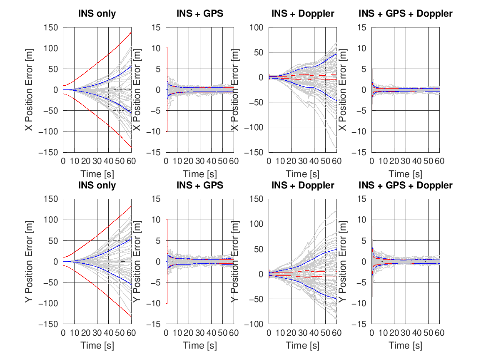

# Lesson 4 — Monte Carlo Validation (the Grey / Red / Blue Plots)

**Previous:** [Lesson 3 — 1D Linear Walkthrough](03-1d-linear-walkthrough.md)
**Next:** [Lesson 5 — 2D Nonlinear Walkthrough](05-2d-nonlinear-walkthrough.md)

---

## Learning objectives

After this lesson you can:

1. Explain why a single filter run proves almost nothing.
2. Read the standardized error plots: grey / red / blue.
3. Test **consistency**: does the filter's claimed uncertainty match reality?
4. Know what NEES is and when to reach for it.

---

## 1. Why one run lies

A single run shows you *one* realisation of the sensor noise and bias draws. A
filter can look brilliant on one realisation and bad on the next. Worse: a filter
that has quietly gone overconfident can look perfectly fine for seconds at a time.

The only honest evaluation is **Monte Carlo**: repeat with fresh randomness many
times (here: 50 runs with redrawn constant biases and fresh sensor noise) and
compare *statistics of the error* against *what the filter claims*.

Both demos use one more trick worth copying: **all filters in a run receive the
identical sensor realisation** ([Demo1D.m:334](../Demo1D.m#L334) "COMMON IMU SENSOR
REALIZATION"). The filters are then compared on the same data, so differences come
from architecture, not from luck.

## 2. The three plot elements

Every error-vs-time subplot in this repository shows:

| Colour | Quantity | Question it answers |
|---|---|---|
| **Light grey** | each individual run's error trace | What does typical behaviour look like? How wild is the spread? |
| **Red** | filter's claimed 1σ, $\sqrt{P}$, averaged over runs | *What does the filter think* its error magnitude is? |
| **Blue** | empirical 1σ — std of the error across the 50 runs | *What is* the actual error magnitude? |

Reproducing from the stored arrays (this is exactly what the scripts do after the
Monte Carlo loop, [Demo1D.m:961](../Demo1D.m#L961)):

```matlab
sigma_mean(:,f) = mean( position_sigma_mc(:,:,f), 1 )';  % red
sigma_emp(:,f)  = std( position_error(:,:,f), 0, 1 )';   % blue
```

## 3. Consistency: red ≈ blue

A filter is **consistent** when its self-assessment matches reality:

$$
\text{red} \approx \text{blue}
$$

Consistency is *the* property that makes fusion work: the Kalman gain is computed
from $P$; if $P$ is wrong, the trust allocation is wrong, and the filter
systematically over- or under-corrects.

Look at `Demo1D.m` position errors:


- **INS only**: red and blue track each other closely. Unsurprising — with no
  updates, $P$ grows purely by the $Q$/$P_0$ model, and the errors are generated by
  exactly the random variables those matrices model. The filter is honest about
  being lost.
- **Aided filters**: both red and blue collapse to small, flat values and agree.
  Honest *and* accurate.

Also note what the grey fan tells you that RMSE alone cannot: for the aided
filters the residual spread is set by GPS/Doppler noise (bounded, stationary),
while for INS-only it is the bias draw — each grey line is parabola-shaped by *its*
bias, so runs separate early and never mix. One number (RMSE) hides this structure;
the plot shows it instantly.

## 4. When blue ≫ red: the overconfidence signature

Now peek ahead at the 2D demo — the INS+Doppler subplot, per-axis position error:



In the "INS + Doppler" column the blue envelope grows to tens of metres while the
red envelope stays near one to a few metres. The filter *claims* metre-level
confidence while its real errors grow unbounded. This is **inconsistency caused by
unmodelled error channels** — here, heading error leaking into the measurements in
a way the Doppler update's covariance does not capture.

Consequences of overconfidence, in order of pain:

1. Gains are too large → the filter "corrects" hard using partially wrong
   information, steering the estimate in wrong directions.
2. The claimed $P$ (and any integrity/protection-level derived from it) is a lie —
   unacceptable in any safety-relevant system.
3. Tuning $Q$/$R$ harder cannot fix it, because the missing uncertainty is *not in
   the model* — in this case the geometry/observability limitation (Lesson 6).

**Habit to build:** whenever a fusion filter misbehaves, before touching any
tuning parameter, plot red vs blue. If they disagree, you have a modelling problem,
not a tuning problem.

## 5. NEES: consistency as a single number

The Normalised Estimation Error Squared compresses consistency into one statistic.
With estimation error $\tilde{x} = \hat{x} - x$ and covariance $P$:

$$
\epsilon = \tilde{x}^\top P^{-1} \tilde{x}
$$

If the filter is consistent, $\epsilon$ is chi-square distributed with $n$ degrees
of freedom ($n$ = number of states in the test). Averaged over Monte Carlo runs,
$\bar\epsilon$ should sit near $n$; run outside the 95% chi-square bounds
($[n - 1.96\sqrt{2n},\ n + 1.96\sqrt{2n}]$ for large run counts) and something is
wrong. See the exercise below to compute it from the stored arrays.

RMSE, red/blue overlays, and NEES are complementary: RMSE says *how big*, red/blue
says *is the error where the filter thinks*, NEES gives a formal pass/fail test.

---

> ### Learning points
> - Never certify a filter on one run; 50 runs with redrawn biases is the minimum honest baseline.
> - Red = claim, blue = reality; consistency (red ≈ blue) is what makes the Kalman gain meaningful.
> - Blue ≫ red = overconfidence = a *model* problem. Tuning is not the fix.
> - NEES turns consistency into a statistical test with known thresholds.

---

### Try it yourself

**Exercise 4.1** — Add this block after the statistics section of `Demo1D.m` to
compute the time-averaged position NEES for each filter (3 position/velocity/bias
states together):

```matlab
nees = zeros(N_MC, N, N_FILTERS);
for mc = 1:N_MC
    for f = 1:N_FILTERS
        for k = 1:N
            % rebuild per-run error vector and covariance is not stored;
            % instead test the bias state alone (its error and sigma are stored):
            e  = bias_error(mc,k,f);
            s2 = bias_sigma_mc(mc,k,f)^2;
            nees(mc,k,f) = e^2 / s2;
        end
    end
end
figure; hold on;
for f = 1:N_FILTERS
    plot(time, mean(nees(:,:,f),1)');
end
yline(1); grid on;
```

Which filter's NEES is near 1 (consistent), and which is not? Why is the *INS-only*
filter consistent even though it is hopelessly inaccurate?

<details>
<summary><em>Solution</em></summary>

All four are (approximately) consistent in 1D — NEES hovers around 1 after
transients. Accuracy and consistency are different properties: INS-only is *wrong
by 75 m but honestly wrong* — its $P$ grows through exactly the same $Q$/$P_0$
machinery that generates the true error. Consistency failures require a mismatch
between the error-generating process and the filter's model of it — which is what
the 2D Doppler geometry creates (Lesson 6), not what plain propagation creates.

</details>

**Exercise 4.2** — Set `N_MC = 5` in `Demo1D.m`. What happens to the blue and red
curves, and which figure becomes misleading fastest?

<details>
<summary><em>Solution</em></summary>

With 5 samples the empirical statistics get noisy: the blue envelope becomes jagged
and its level fluctuates ±30% easily ($\sigma/\sqrt{N-1}$ relative error on a
std estimate). Red is unaffected (it averages nearly identical per-run covariances).
The comparison red-vs-blue becomes unreliable — which is the lesson: *the quality of
a consistency check is limited by the Monte Carlo sample size.* 50 runs is a
practical floor for eyeballing; formal NEES thresholds need more.

</details>

---

**Previous:** [Lesson 3 — 1D Linear Walkthrough](03-1d-linear-walkthrough.md)
**Next:** [Lesson 5 — 2D Nonlinear Walkthrough](05-2d-nonlinear-walkthrough.md)
