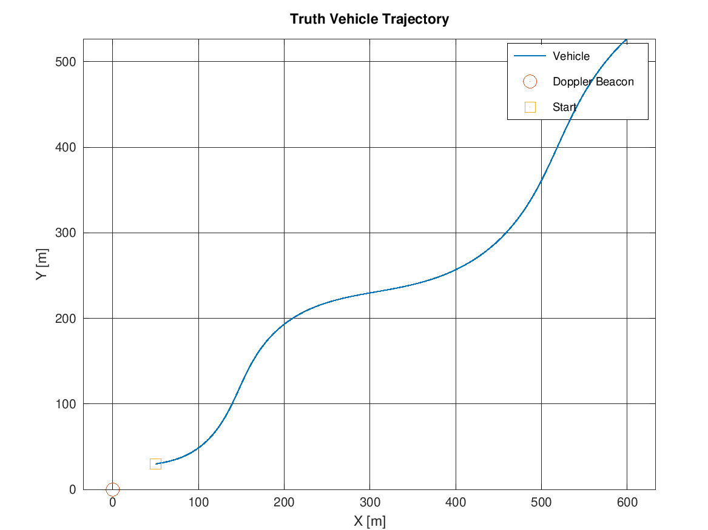
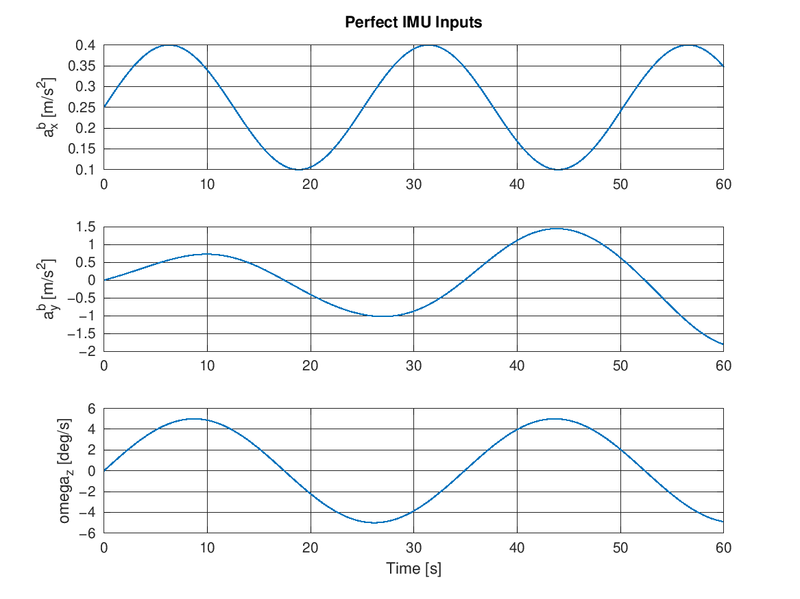
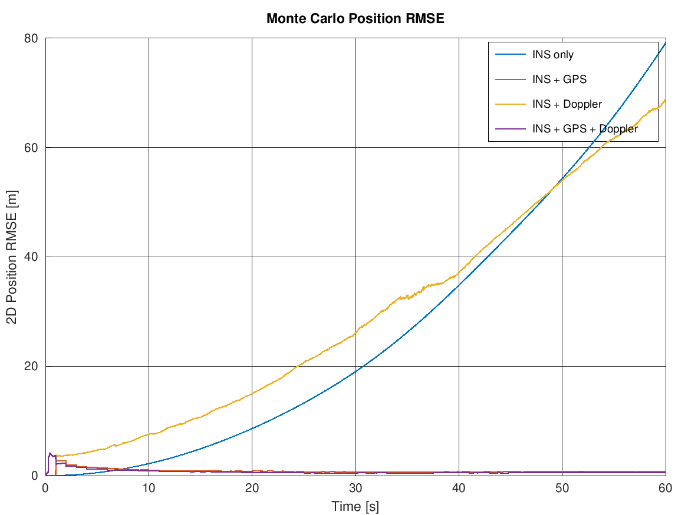
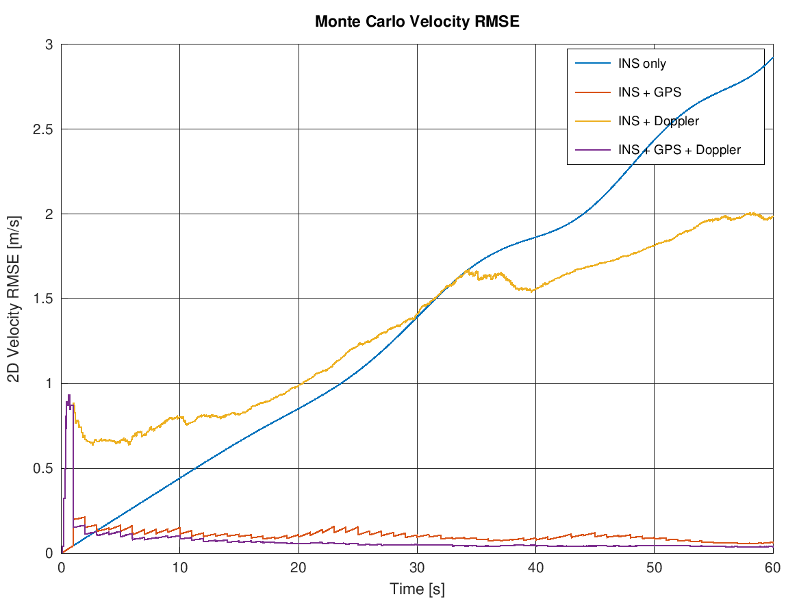
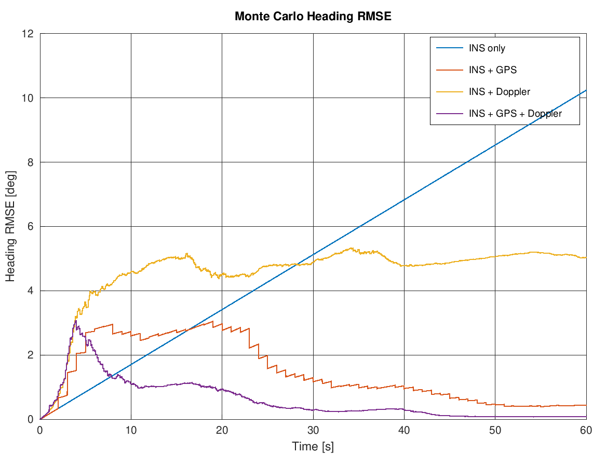
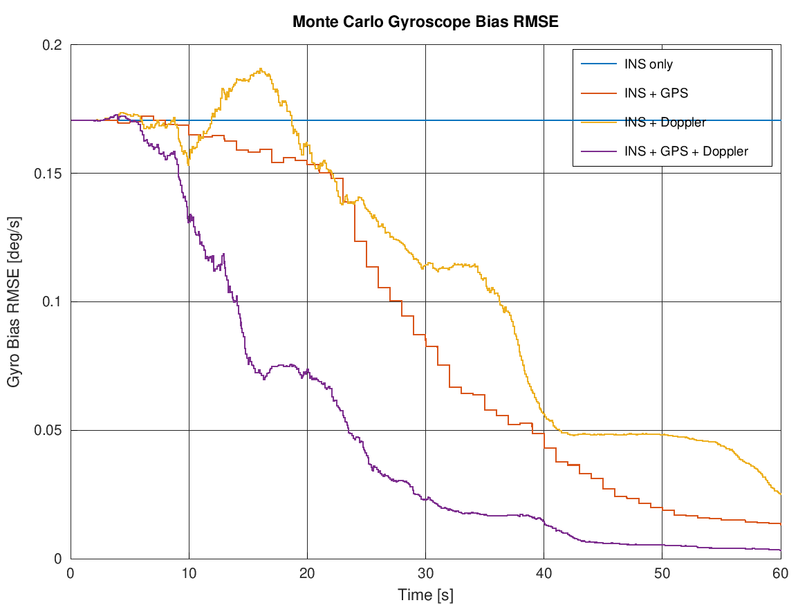
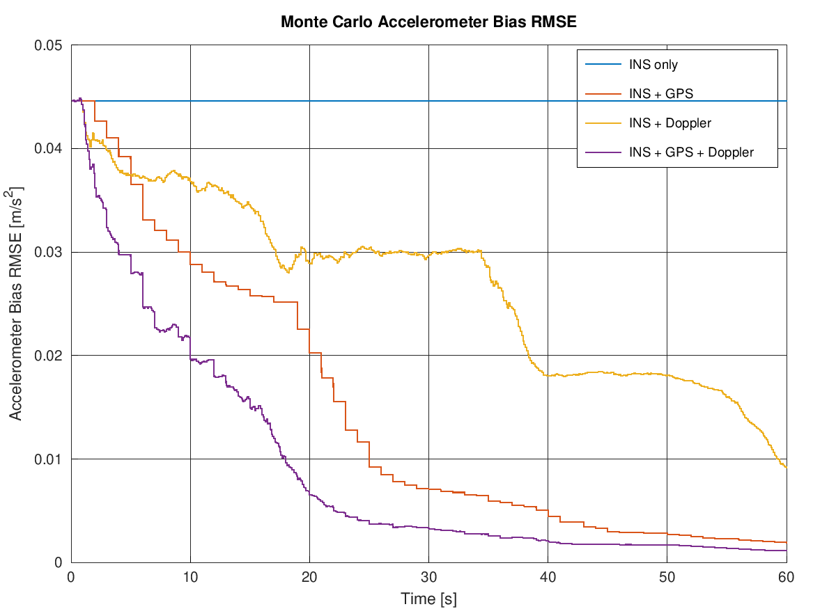
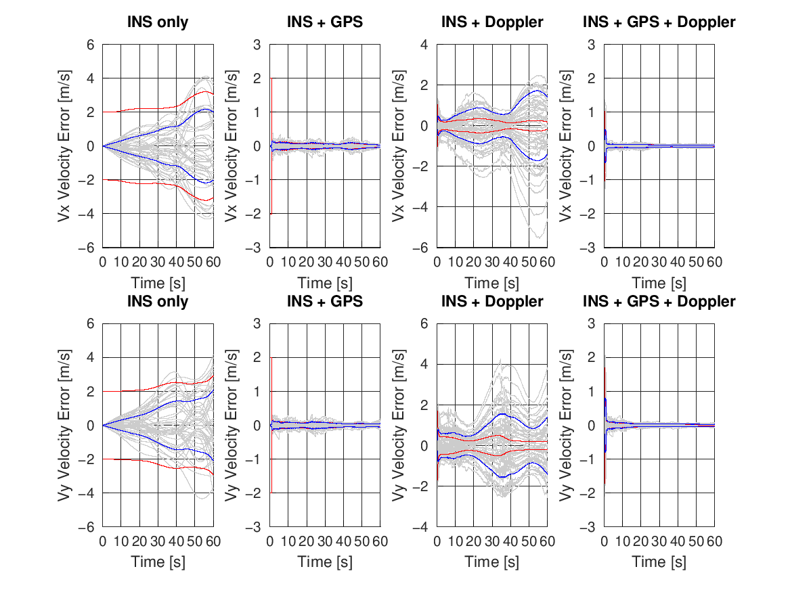

# Lesson 5 — 2D Nonlinear Walkthrough (`NonLinear2D.m`)

**Previous:** [Lesson 4 — Monte Carlo Validation](04-monte-carlo-validation.md)
**Next:** [Lesson 6 — Observability and Limits](06-observability-and-limits.md)

---

## Learning objectives

After this lesson you can:

1. Identify what makes a problem nonlinear for a Kalman filter and what the EKF does about it.
2. Read and trust the process and measurement Jacobians in `NonLinear2D.m`.
3. Handle heading bookkeeping (wrap-around) correctly.
4. Interpret the 2D results — and explain why "INS + Doppler" is *not* the star here.

---

## 1. Scenario

The same vehicle type as Lesson 3, but in the plane:

- Starts at $(x_0, y_0) = (50, 30)$ m, speed 5 m/s, heading 10°.
- Longitudinal acceleration $0.25 + 0.15\sin(0.25t)$, yaw rate
  $\pm 5°/\text{s}$ sinusoid ([NonLinear2D.m:136](../NonLinear2D.m#L136),
  [:143](../NonLinear2D.m#L143)) — the vehicle traces an S-curve to roughly
  $(630, 530)$ over 60 s:

- The Doppler beacon sits at the **origin**. Note how the run unfolds: the vehicle
  starts 58 m from the beacon and ends ~820 m away, with the line of sight
  rotating only slowly. Keep two numbers in mind — **58 m and 820 m** — they are
  the entire plot of Lesson 6.

The true body-frame measurements: longitudinal accel, lateral (centripetal)
accel $a_y = v\,\dot\psi$, and yaw rate:

## 2. The state and where the nonlinearity lives

Eight states ([NonLinear2D.m:367](../NonLinear2D.m#L367)):

$$
X = [\,x,\ y,\ v_x,\ v_y,\ \psi,\ b_{ax},\ b_{ay},\ b_g\,]^\top
$$

Two things break linearity:

1. **Body → navigation rotation.** The corrected body accelerations are rotated by
   the *estimated* heading before being integrated:

   $$
   \begin{bmatrix} a_x^n \\ a_y^n \end{bmatrix}
   = \begin{bmatrix} \cos\hat\psi & -\sin\hat\psi \\ \sin\hat\psi & \cos\hat\psi \end{bmatrix}
   \begin{bmatrix} a_x^b \\ a_y^b \end{bmatrix}
   $$

   The state transition is therefore nonlinear in $\hat\psi$ — and, crucially,
   *errors in heading rotate the acceleration the wrong way*, steering position
   error growth.

2. **The Doppler measurement.** Range $r = \sqrt{p_x^2 + p_y^2}$ and range-rate
   $\dot r = (\mathbf{p}\cdot\mathbf{v})/r$ are nonlinear functions of the state.

## 3. The EKF recipe

The EKF keeps the KF machinery of Lesson 2 and replaces exact models by
**local linearisations, recomputed at every step**:

$$
F \approx \left.\frac{\partial f}{\partial x}\right|_{\hat{x}}, \qquad
H \approx \left.\frac{\partial h}{\partial x}\right|_{\hat{x}}
$$

### Process Jacobian ([NonLinear2D.m:520–548](../NonLinear2D.m#L520))

Beyond the trivial blocks, three coupling groups deserve attention:

- `F(1:2,5)`, `F(3:4,5)` — **heading error rotates acceleration**: the derivative
  of the nav-frame acceleration w.r.t. $\psi$. This is how gyro error becomes
  *position* error in the covariance.
- `F(1:4,6)`, `F(1:4,7)` — accelerometer biases leak into position/velocity
  through the rotation (note the $\cos\psi$, $\sin\psi$ entries).
- `F(5,8) = -dt` — gyro bias integrates directly into heading.

Everything the filter "knows" about how IMU errors become navigation errors is
encoded in these blocks. If you delete `F(1:2,5)`, the filter becomes blind to
heading uncertainty and the position covariance collapses incorrectly.

### Measurement Jacobian ([NonLinear2D.m:647–661](../NonLinear2D.m#L647))

For range and range-rate:

$$
H = \begin{bmatrix}
\dfrac{p_x}{r} & \dfrac{p_y}{r} & 0 & 0 & 0 & 0 & 0 & 0\\[4pt]
\dfrac{v_x}{r} - \dfrac{p_x q}{r^3} & \dfrac{v_y}{r} - \dfrac{p_y q}{r^3} & \dfrac{p_x}{r} & \dfrac{p_y}{r} & 0 & 0 & 0 & 0
\end{bmatrix}, \quad q = \mathbf{p}\cdot\mathbf{v}
$$

Read row 1 as "the radial unit vector": range senses position **only along one
direction**. Row 2 mixes position and velocity — and contains no heading column,
which sounds innocent but is the source of the 2D Doppler weakness (Lesson 6).

### Practical bookkeeping: heading wrap

Heading is wrapped to $[-\pi, \pi]$ with
`atan2(sin(ψ), cos(ψ))` after every propagation and every update
([NonLinear2D.m:508](../NonLinear2D.m#L508)). Skipping this lets $\psi$ walk past
$\pi$ while its *error* stays small — and then `cos`/`sin` coupling in $F$ goes
fine, but any comparison or unwrapped integral diverges. Cheap insurance; always do it.

Covariance updates remain in Joseph form, exactly as in Lesson 2.

## 4. Results — the surprise

Final-time RMSE over 50 runs:

| Filter | Pos [m] | Vel [m/s] | Heading [°] | Gyro bias [°/s] |
|---|---|---|---|---|
| INS only | 79.08 | 2.92 | 10.24 | 0.171 |
| INS + GPS | 0.69 | 0.062 | 0.44 | 0.0132 |
| INS + Doppler | 68.97 | 1.99 | 5.05 | 0.0249 |
| INS + GPS + Doppler | **0.52** | **0.037** | **0.081** | **0.0033** |

Read the plots carefully:

- GPS-based filters are excellent: GPS observes $x, y, v_x, v_y$ **directly and
  completely**, every second.
- **INS + Doppler is barely better than dead reckoning** — and the position RMSE
  curves cross: from $t \approx 5$ s to $t \approx 48$ s the Doppler filter is
  actually *worse* than pure INS, only edging ahead in the last seconds.
- Yet Doppler clearly *does* help: velocity error (1.99 vs 2.92 m/s), heading
  (5.0° vs 10.2°) and gyro bias (0.025 vs 0.171 °/s) all improve substantially.

So the beacon teaches the filter a lot, but its *position* stays poor. Heading and
gyro bias converge late — the gyro-bias and accel-bias RMSE curves only bend down
in the final third of the run:

And Lesson 4's consistency test flags the disease: in the per-axis Monte Carlo
plots, the INS+Doppler blue envelope towers over its red envelope — the filter is
confident of things it cannot actually know.

Why does the same beacon that delivered 4 cm in 1D fail here? That is Lesson 6 —
and it is the most valuable systems lesson in this repository.

---

> ### Learning points
> - Nonlinearity enters through rotation (heading) and through the measurement geometry; the EKF handles both by per-step Jacobians.
> - The Jacobian's off-diagonal blocks *are* the filter's understanding of error propagation — heading→position, bias→everything.
> - Wrap heading with `atan2` after every propagation and update.
> - A sensor can simultaneously be highly informative (velocity, heading, gyro bias all improved) *and* fail to bound the quantity you care about (position). "Did the filter improve?" and "did the filter converge?" are different questions.

---

### Try it yourself

**Exercise 5.1** — Verify a Jacobian numerically. Add a finite-difference check of
the Doppler Jacobian at a few points along the trajectory: perturb each state by
$\delta = 10^{-6}$, recompute $h$, and compare $(h(\hat{x}+\delta e_i) -
h(\hat{x}-\delta e_i))/2\delta$ against the analytic $H$ columns.

<em>Solution</em>

Sketch for state 1 ($x$): after the Doppler block computes `px, py, q, r, rr`,
evaluate the analytic entries `H(1,1)=px/r`, `H(2,1)=vx/r-px*q/r^3`, then perturb:
`h_plus` with `X(1,f)+delta`, `h_minus` with `X(1,f)-delta`, and form the numeric
derivative. Expect agreement to ~7 digits. If you had an algebra slip in
`drr_dx` (the $-p_x q/r^3$ term is the usual victim), the numeric check exposes it
immediately. Professional habit: always ship a finite-difference Jacobian test with
EKF code.

**Exercise 5.2** — Increase the yaw excitation: `gyro_truth = (15*pi/180) * sin(0.4*time)`
([NonLinear2D.m:143](../NonLinear2D.m#L143)). Predict the effect on the INS+Doppler
filter, then run.

<em>Solution</em>

Stronger, faster turning rotates the line of sight relative to the velocity much
more often — geometry diversity arrives sooner. The INS+Doppler filter identifies
heading and gyro bias faster and its position RMSE improves (still far from
GPS-level; the *structural* limitation of Lesson 6 remains, but the same
limitation bites less when the geometry keeps changing). This foreshadows the
lesson: Doppler observability is geometry-limited, and you can buy observability
with manoeuvres.

**Exercise 5.3** — Give the filters a wrong initial heading:
`X(5,f) = heading0 + 5*pi/180` in the initialization block. Which filter recovers
fastest, and what does that tell you about initial alignment requirements for
Doppler-only navigation?

<em>Solution</em>

The GPS-based filters remove the heading error within seconds (position/velocity
observations reveal the wrong-way drift immediately). The Doppler-only filter
recovers slowly — heading is only weakly observable through one line of sight.
Practical takeaway: Doppler-only navigation needs good initial alignment (or
manoeuvre excitation); design the alignment phase accordingly.

---

**Previous:** [Lesson 4 — Monte Carlo Validation](04-monte-carlo-validation.md)
**Next:** [Lesson 6 — Observability and Limits](06-observability-and-limits.md)
