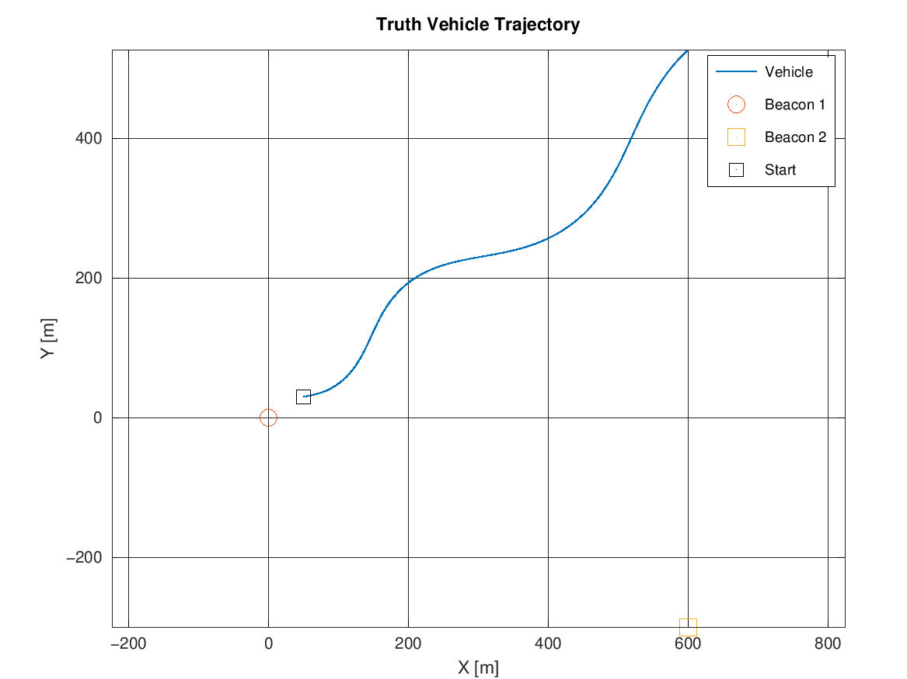
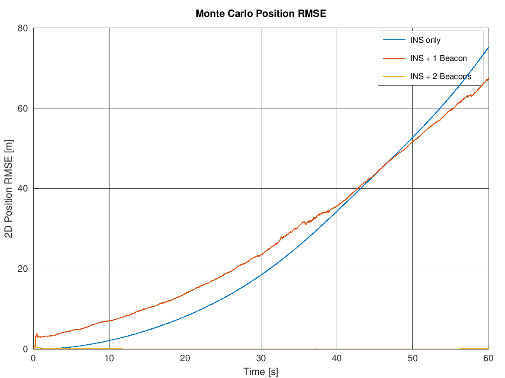
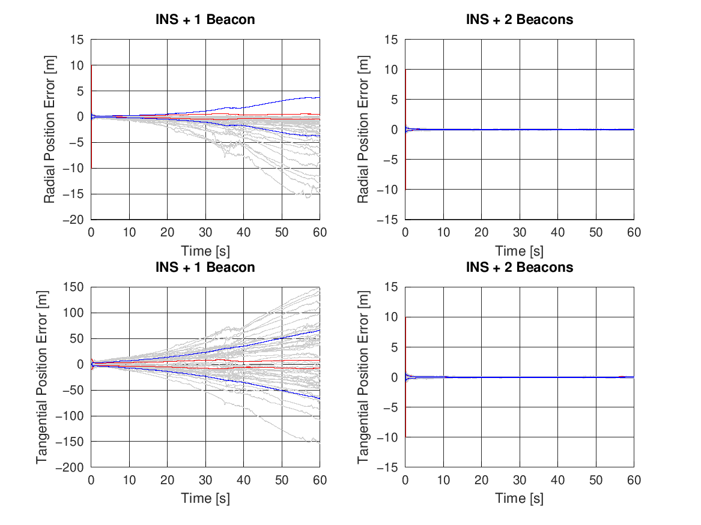
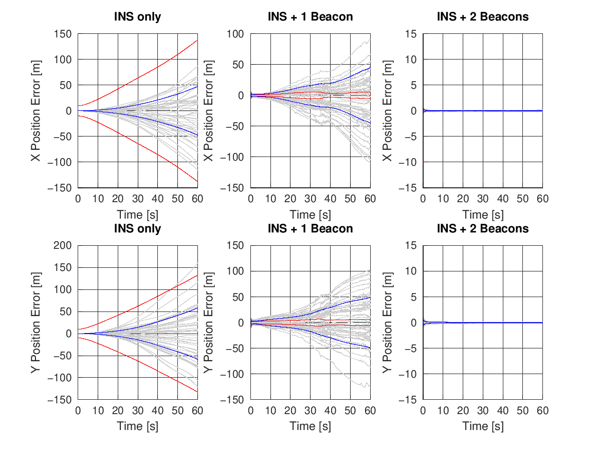

# Lesson 6 — Observability and the Limits of the EKF

**Previous:** [Lesson 5 — 2D Nonlinear Walkthrough](05-2d-nonlinear-walkthrough.md)
**Next:** [Lesson 7 — Summary and Exercises](07-summary-and-exercises.md)

---

## Learning objectives

After this lesson you can:

1. Explain why one Doppler beacon transforms a 1D filter but barely helps a 2D one.
2. Reason about observability from measurement geometry (radial vs tangential).
3. Use error decomposition and consistency plots to *diagnose* the failure mode.
4. Name the practical limits of EKF-based fusion and the standard mitigations.

This lesson uses [`TwoBeacon2D.m`](../TwoBeacon2D.m) — the same 2D nonlinear EKF as
Lesson 5, with **no GPS** and three estimators: INS only, INS + one beacon, and
INS + two beacons.

---

## 1. The puzzle

| Scenario | INS-only | Best Doppler-only result |
|---|---|---|
| **1D** (`Demo1D.m`) | 75.4 m | **0.041 m** — a ~1800× improvement |
| **2D** (`NonLinear2D.m`) | 79.1 m | 69.0 m — a marginal, late win |

Same beacon physics (0.5 m range, 0.05 m/s range-rate, 10 Hz). Same EKF discipline.
The difference is **geometry**, not code quality.

## 2. How much can two scalars say?

The 2D filter carries 8 states. Each beacon contributes exactly **two scalars**:
range $r$ and range-rate $\dot r$. Geometry decides what those two numbers can see.

```text
                tangential direction  (NOT observed)
                       ↑
           · · · · · · | · · · · · ·
         ·             |             ·
       ·               |              ·
      ·                |               ·
      ·      BEACON ───┼───►  VEHICLE  ·   ← radial direction
       ·               |   (on the     ·      (observed by r and r-dot)
        ·              |    circle)  ·
          · · · · · ·  |  · · · · ·
                       ↓
```

- **Range** $r$ pins the estimate onto a *circle* around the beacon. It observes
  position **only radially**. Sliding along the circle — the tangential direction —
  changes nothing that the range can see.
- **Range-rate** $\dot r = \hat{r}\cdot\mathbf{v}$ observes velocity **only
  cross-LOS**: it sees how fast the vehicle approaches the beacon, not how it
  moves along the circle.

Two unobservable directions per beacon. The filter can slide freely around the
constant-range circle, and no innovation ever corrects it. In 1D there *is no*
tangential direction — that is the whole difference.

## 3. The heading–velocity ambiguity

Why doesn't the range-rate at least pin the tangential *velocity*, stopping the
slide? Because of heading. The predicted measurement is

$$
\dot r = \hat{r}\cdot \mathbf{v}(\hat\psi), \qquad
\frac{\partial \dot r}{\partial \psi} = \hat{t}\cdot\mathbf{v} \;=\; \text{(cross-LOS speed)}
$$

A small heading error $\tilde\psi$ changes the predicted range-rate by
$v\,\tilde\psi$ in the cross-LOS direction — **exactly the signature of a
tangential velocity error**. Through a single, slowly-moving line of sight, "my
heading is wrong" and "my sideways velocity is wrong" are nearly indistinguishable;
the filter resolves them only as the geometry rotates. This trajectory rotates the
geometry gently (an S-curve, yaw $\pm 5°/\text{s}$) while the range grows
58 m → 820 m — so disambiguation is slow: heading RMSE is still 5° at $t = 60$ s
and the gyro bias converges only in the last third of the run.

Two aggravating effects make the *position* worse than intuition expects:

1. **The lever arm.** Position error = range × angular error. The same few degrees
   of unresolved heading/velocity-direction error becomes more metres every second
   as the vehicle recedes: $r$ grows from 58 m to 820 m.
2. **Overconfident corrections.** The filter treats range-rate as a 0.05 m/s
   velocity measurement. With unresolved heading error, innovations get
   misattributed to velocity instead of heading — the update *actively steers the
   estimate around the range circle* into the tangential direction. This is
   Lesson 4's overconfidence signature doing real damage.

## 4. The experiment: `TwoBeacon2D.m`

A second beacon at $(600, -300)$ — chosen so its line of sight differs from
beacon 1's by >100° along the whole trajectory. Two range circles intersect in a
point: the tangential direction of one beacon is roughly the radial direction of
the other. Position becomes fully observable.

Final Monte Carlo results (50 runs; radial/tangential are 1σ of the position error
resolved relative to beacon 1):

| Filter | Position RMSE [m] | Radial σ [m] | Tangential σ [m] |
|---|---|---|---|
| INS only | 75.2 | 50.3 | 56.1 |
| INS + 1 Beacon | 67.4 | **3.8** | **66.5** |
| INS + 2 Beacons | **0.092** | 0.051 | 0.076 |

The story in three numbers:

- **One beacon**: radial error *bounded at 3.8 m* — the range measurement works
  exactly as advertised. Tangential error grows to 66 m — unobserved, integrating
  heading-induced velocity error. The total is the tangential component, almost
  entirely.
- **Two beacons**: **9 cm.** The same EKF, same tuning discipline, one extra
  beacon — a ~730× improvement over one beacon, because the previously invisible
  direction is now measured.





Note the crossover in the RMSE plot: from $t\approx4$ s to $t\approx47$ s the
single-beacon filter is *worse than pure dead reckoning*. Dead reckoning fails
quadratically (slow at first); the under-observable filter fails almost linearly
(fast immediately). This is why "worse than doing nothing" is not a paradox — it
is arithmetic.

## 5. Reading the failure in the filter's own coordinates

`TwoBeacon2D.m` decomposes the position error into radial and tangential
components relative to beacon 1 (grey/red/blue as always):



- **Top left (1 beacon, radial)**: grey traces bounded, blue ≈ 4 m. The beacon
  does its job along its line of sight — even the red covariance projection is
  roughly right, with mild overconfidence from the heading leakage.
- **Bottom left (1 beacon, tangential)**: grey fans out to ±150 m, blue grows
  nearly linearly, red stays metres — the filter is *confidently wrong* in exactly
  the direction it cannot see.
- **Right column (2 beacons)**: both components collapse to centimetres. Red ≈
  blue — the filter becomes consistent when its measurements span the state.

And the per-axis view of the same experiment:



## 6. The limits of the EKF — and standard mitigations

| Limitation | Seen here | Mitigation |
|---|---|---|
| **Observability is decided by geometry**, not by the filter | 1 beacon: radial/tangential blind spot | Add geometry: second beacon, manoeuvres, GPS — make the measurements *span* the state |
| **Linearisation errors** when errors grow large | Radial overconfidence as heading error grows | Keep errors small (good aiding), iterate (IEKF), or use UKF/particle filters for badly nonlinear cases |
| **Consistency requires the error model to be complete** | Blue ≫ red: heading error leaked into range-rate; $P$ never knew | Monitor red-vs-blue / NEES in Monte Carlo; enlarge the state (estimate heading error) rather than inflate $Q$ blindly |
| **Overconfident covariance causes actively harmful corrections** | Single-beacon updates steering the estimate tangentially | Same as above — consistency first, tuning second |
| **"More sensors" ≠ "better"** | Doppler: spectacular in 1D, marginal in 2D | Evaluate the *information direction* of each sensor against the state, not its datasheet |

The final table of `NonLinear2D.m` makes the positive case: INS + GPS + Doppler is
the best filter (0.52 m, heading 0.08°) not because either sensor is sufficient
alone, but because GPS observes the full position/velocity vector at 1 Hz while
Doppler stitches high-rate velocity between updates — their information
*directions* complement each other.

---

> ### Learning points
> - Observability is a property of **geometry × trajectory**, decided before any code runs.
> - One range + range-rate = one position direction + one velocity direction. Everything else is a slow inference.
> - A filter can be inconsistent *and* worse-than-INS mid-run while still improving velocity, heading, and biases — evaluate states separately.
> - The tangential failure was 100% predictable from geometry: the second beacon proves the fix is structural, not tuning.
> - Diagnose with the filter's own covariance: red-vs-blue and radial/tangential decompositions locate the unobservable direction precisely.

---

### Try it yourself

**Exercise 6.1** — Move beacon 2 to $(100, 500)$ ([TwoBeacon2D.m:227–228](../TwoBeacon2D.m#L227)).
Before running: how does the beacon-1/beacon-2 line-of-sight angle change compared
with $(600, -300)$, and what do you expect for the two-beacon filter?

<details>
<summary><em>Solution</em></summary>

From the trajectory (which stays in the region $x > 50$, $y$ up to ~500), a beacon
at $(100,500)$ gives lines of sight much closer to beacon 1's (both roughly
"up-left" of the vehicle at times) — the two range circles intersect at shallow
angles, so the tangential direction is only weakly observed. Expect the two-beacon
filter to stay better than one beacon but clearly worse than the 9 cm of the
well-separated pair. Geometric *dilution* — the same reason GPS satellites clumped
in the sky give poor fixes.

</details>

**Exercise 6.2** — Make both beacons range-only (set `sigma_doppler_rr = 1e6` in
`TwoBeacon2D.m`). The position should remain well observed — so what do you lose?

<details>
<summary><em>Solution</em></summary>

Two ranges still triangulate position, so position stays bounded — but velocity
loses its direct (cross-LOS) observation, and it was the velocity channel that made
heading/gyro-bias/accel-bias convergence fast. Expect position to remain decent,
velocity to degrade substantially, and all three bias states to converge much more
slowly. Range-rate is the "state dynamics" information; range is the "state
absolute" information. A complete filter wants both.

</details>

**Exercise 6.3** — In `TwoBeacon2D.m`, add a radial/tangential consistency figure
for the INS-only filter (extend `col_filters` to include `FILTER_INS` in PLOT 3).
Is the INS-only filter consistent in these coordinates?

<details>
<summary><em>Solution</em></summary>

Yes — approximately. With no updates, the error grows through exactly the process
the $P$ model describes ($G$, $P_0$), so red tracks blue in both directions
(50 m σ radial and tangential, nearly isotropic). Compare with the single-beacon
case: *aiding with unobservable geometry* produces inconsistency, while *no aiding
at all* stays honest. The moral: inconsistency enters when the filter believes it
is observing directions it cannot actually observe.

</details>

---

**Previous:** [Lesson 5 — 2D Nonlinear Walkthrough](05-2d-nonlinear-walkthrough.md)
**Next:** [Lesson 7 — Summary and Exercises](07-summary-and-exercises.md)
